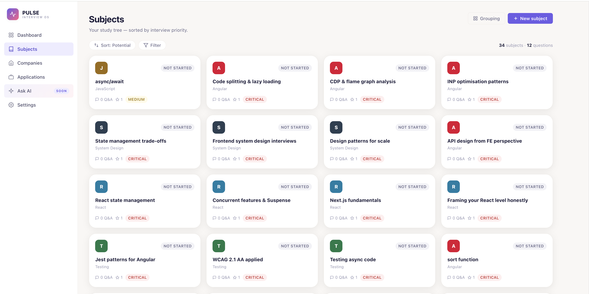
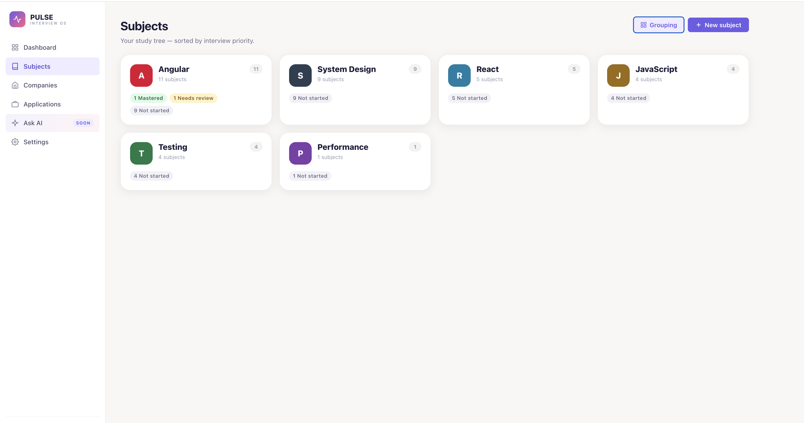
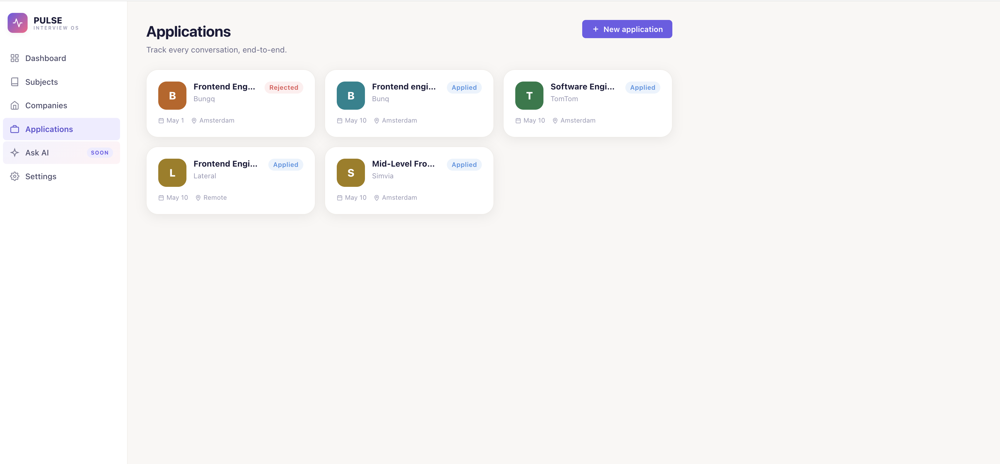

# Pulse — Interview OS

> The playful workspace for serious candidates. Track every subject, company, and application — and watch your prep heartbeat grow stronger every day.

---

## What is Pulse?

Pulse is a personal interview preparation platform built for software engineers who take their job search seriously. Instead of scattered Notion pages, spreadsheets, and sticky notes, Pulse gives you one place to organize your knowledge, track your applications, and measure your daily momentum — so you walk into every interview with quiet confidence.

---

## Screenshots





---

## Features

### Study Subjects

Organize everything you need to learn into subjects. Each subject has:

- **Priority** — Critical, High, Medium, Low
- **Status** — Not Started, In Progress, Needs Review, Confident, Mastered
- **Category** — Angular, React, JavaScript, TypeScript, System Design, and more
- **Sortable table** — sort by priority, title, Q&A count, or status
- **Inline status picker** — change status directly from the table without opening the subject
- **Rich notes** — full Tiptap rich text editor with 6 switchable code highlight themes
- **Q&A pairs** — add questions and answers with difficulty levels (easy / medium / hard)
- **Company tags** — link subjects to the companies that asked about them

### Company Intelligence

Link interview questions directly to the companies that asked them. Build a study plan driven by real interview signal, not guesswork.

### Application Pipeline

Track every job application with status, salary notes, and resume versioning.



### Code Theme Switcher

Choose your syntax highlighting theme from the Settings page — with a live TypeScript preview so you can see exactly what each theme looks like before switching. Six themes available:

| Theme          | Style                 |
| -------------- | --------------------- |
| GitHub Dimmed  | Dark, muted — default |
| GitHub Dark    | Dark, high contrast   |
| Atom One Dark  | Dark, warm            |
| Tokyo Night    | Dark, cool blue       |
| Monokai        | Dark, vibrant         |
| Atom One Light | Light                 |

### Ask AI _(Coming Soon)_

AI-generated study outlines and Q&A sessions tailored to your weak spots.

---

## Workflow

```
01 Capture   — Drop in any subject, question, or company in seconds.
02 Prioritize — Pulse surfaces what matters most this week.
03 Land       — Track applications and walk in prepared.
```

---

## Tech Stack

| Layer               | Technology                                |
| ------------------- | ----------------------------------------- |
| Framework           | Angular 21 (standalone, zoneless, OnPush) |
| State management    | NgRx SignalStore                          |
| Auth & database     | Supabase (Google OAuth + PostgreSQL)      |
| Rich text editor    | Tiptap                                    |
| Syntax highlighting | highlight.js                              |
| Styling             | SCSS with CSS custom properties           |
| Build system        | Nx monorepo                               |
| E2E testing         | Playwright                                |
| Unit testing        | Vitest                                    |
| Deployment          | Cloudflare Pages                          |

---

## Architecture

Nx monorepo with two Angular 21 applications:

```
/
├── apps/
│   ├── job-mate/           # Pulse — active
│   └── wealth-mate/        # Future: personal finance app (frozen)
├── libs/
│   └── shared/             # Shared components, services, models
├── e2e/                    # Playwright end-to-end tests
├── workflow.md             # Feature log (updated after every ship)
├── DECISIONS.md            # Architecture decision record
├── angular.json
└── package.json
```

### Angular 21 Patterns

- **Zoneless change detection** — no Zone.js; signals drive all reactivity
- **`signal()` / `computed()` / `effect()`** for all local and derived state
- **`input()` / `output()` signal APIs** — no `@Input()` / `@Output()` decorators
- **Standalone components only** — no NgModules
- **`inject()`** over constructor injection everywhere
- **Functional route guards** — no class-based guards
- **`loadComponent`** for lazy-loaded routes

---

## Getting Started

### Prerequisites

- Node.js 22+
- A [Supabase](https://supabase.com) project (free tier works)

### Install

```bash
git clone https://github.com/tizhad/pulse.git
cd pulse
npm install
```

### Environment Variables

Add your Supabase credentials to Cloudflare Pages (or a local `.env`):

```
SUPABASE_URL=https://your-project.supabase.co
SUPABASE_ANON_KEY=your-anon-key
```

### Dev Server

```bash
npx nx serve job-mate
```

Open `http://localhost:4200`.

### Production Build

```bash
npx nx build job-mate --configuration=production
```

Output: `dist/apps/job-mate/browser/`

---

## Pages & Routes

| Route           | Page                                    |
| --------------- | --------------------------------------- |
| `/`             | Landing page                            |
| `/auth`         | Google OAuth sign-in                    |
| `/dashboard`    | Weekly overview and streak              |
| `/subjects`     | Study subjects table                    |
| `/subjects/:id` | Subject detail — notes, Q&A, edit panel |
| `/companies`    | Company tracker                         |
| `/applications` | Application pipeline                    |
| `/ask`          | Ask AI _(coming soon)_                  |
| `/settings`     | Code theme and preferences              |

---

## Deployment (Cloudflare Pages)

| Setting                | Value                        |
| ---------------------- | ---------------------------- |
| Build command          | `npm run build`              |
| Build output directory | `dist/apps/job-mate/browser` |
| Node version           | 22                           |
| `NX_NO_CLOUD` env var  | `true`                       |

> `NX_NO_CLOUD=true` is required — Cloudflare's build environment is not connected to Nx Cloud and the build will exit without it.

---

## License

MIT
